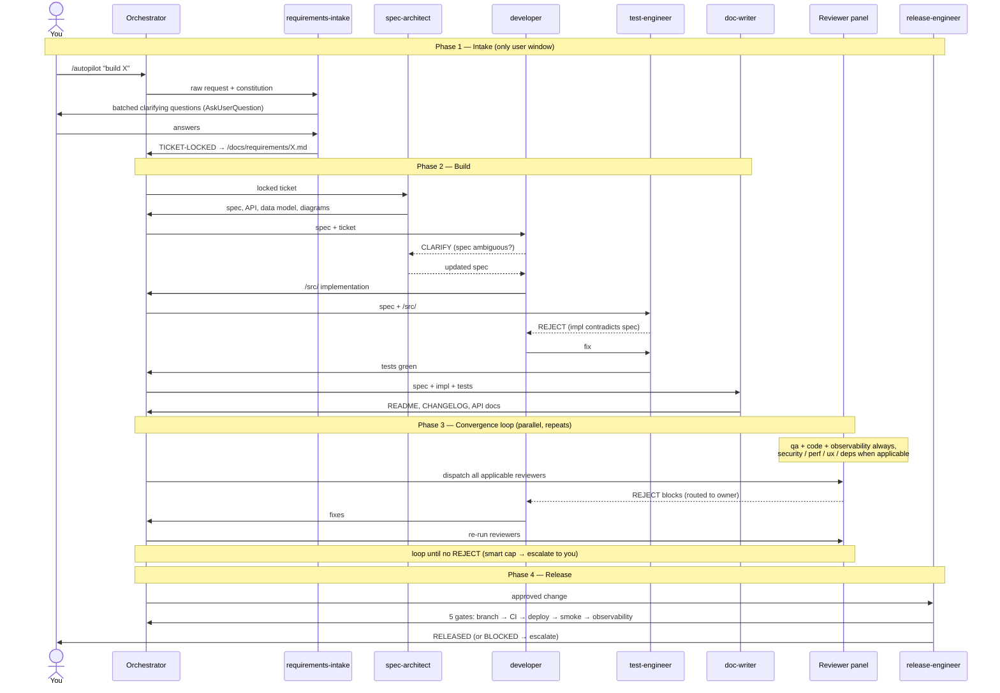
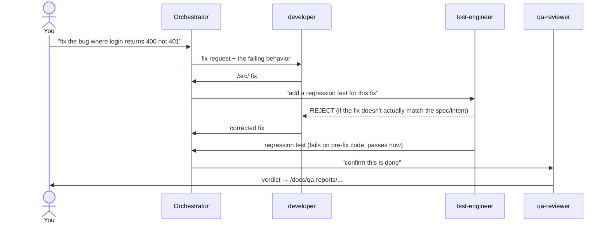
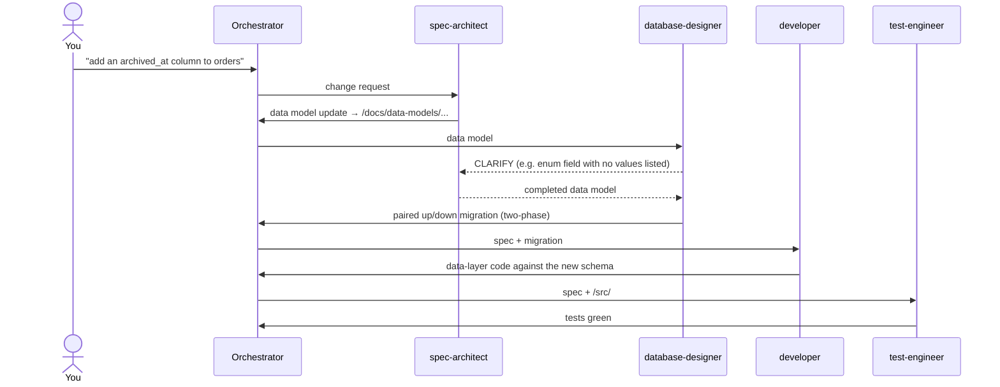
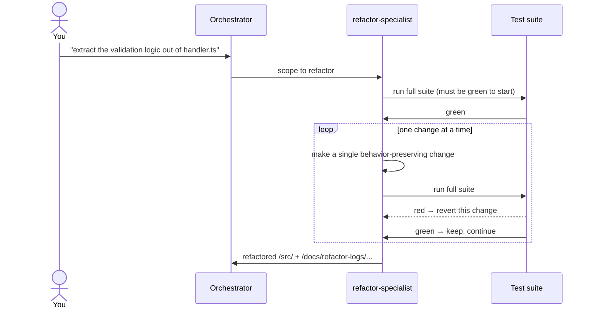
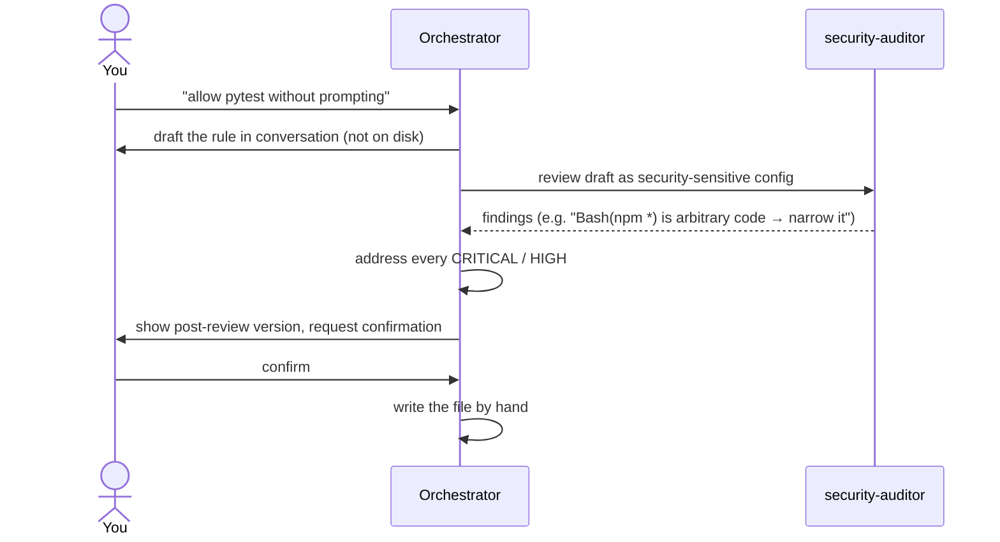
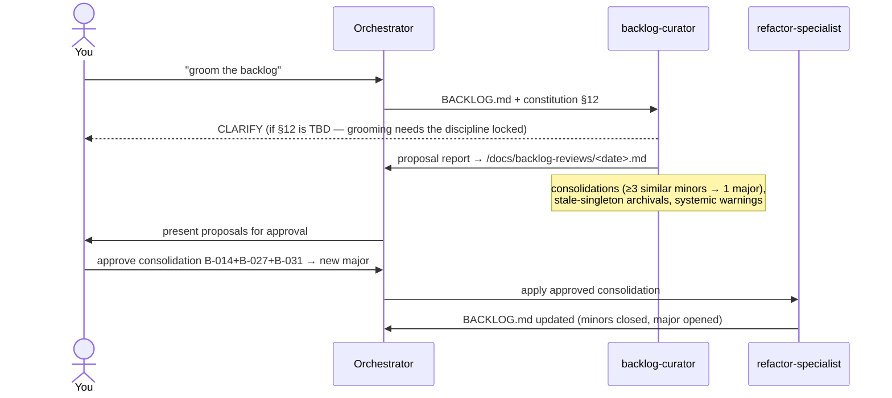

# Task flows — how work moves between agents

> **What this covers:** end-to-end traces of the most common task types,
> showing which agents fire, in what order, and where work bounces back via
> `CLARIFY` / `REJECT`. Each flow has a sequence diagram and a narrative.
>
> **When to read it:** during onboarding, to build a mental model of the
> pipeline as motion rather than a list of agents. Also when an agent did
> something you didn't expect and you want to know *where in the flow* the
> surprise happened.

`how-it-works.md` describes each agent in isolation and lists the four
autopilot phases. This page is the complementary view: the **handoffs** —
what one agent passes to the next, and what comes back when an agent
disagrees. If `how-it-works.md` is the cast list, this is the choreography.

---

## How to read these diagrams

- **Actors** are agents (and you, the user). The **orchestrator** is Claude
  reading `CLAUDE.md` — the router that dispatches agents and ferries
  `CLARIFY` / `REJECT` blocks. It never writes code, tests, or docs itself.
- **Solid arrows** are forward handoffs (the artifact moves downstream).
- **Dashed arrows** are upstream bounces — a `CLARIFY` (ambiguity) or a
  `REJECT` (contradiction). These are the parts a static "pipeline order"
  diagram hides, and the parts that confuse newcomers most.
- A flow can re-enter an earlier agent any number of times. The diagrams
  show the *shape*, not a fixed iteration count.

> **Two kinds of "why did it do that?"** A flow diagram answers *routing*
> surprises — "why did control go to `spec-architect` when I asked
> `developer` to build?" For *behavior* surprises — "why did the auditor
> REJECT this specific line?" — the answer is in the agent's own definition
> (`.claude/agents/<agent>.md`) and the constitution precedence rule, not
> here. This page tells you *where* a decision was made; the agent file
> tells you *why*.

> **Autonomy levels (§14).** These diagrams show the full path. *Where the
> orchestrator pauses for your approval* — before a commit, a PR, or the
> merge — depends on the project's CONSTITUTION §14 autonomy level
> (`review-all` / `review-critical` / `autonomous`) plus any stricter
> personal override. At `review-all` (the default) it pauses at each of
> those points; at `autonomous` it drives straight through. The floor
> (protected branches PR-only, permission model, green CI, security-sensitive
> confirmation) holds regardless of level. See [`constitution.md`](constitution.md) §14.

The flows below, in rough order of how often you'll hit them:

1. [Autopilot feature](#flow-1--autopilot-feature-the-full-pipeline)
2. [Bug fix with a regression test](#flow-2--bug-fix-with-a-regression-test-manual-mode)
3. [Schema change](#flow-3--schema-change)
4. [Behavior-preserving refactor](#flow-4--behavior-preserving-refactor)
5. [Security-sensitive config change](#flow-5--security-sensitive-config-change)
6. [Backlog grooming and burndown](#flow-6--backlog-grooming-and-burndown)

---

## Flow 1 — Autopilot feature (the full pipeline)

**When:** `/autopilot <description>` — any change that adds behavior,
modifies a contract, or touches multiple files.

**The shape:** intake (one user window) → build → convergence loop →
release. The only normal-path user interaction is Phase 1; everything after
runs autonomously unless a smart-cap escalation or an `URGENT: yes` escape
fires.

**Where it bounces:**

- `developer` → `spec-architect` (`CLARIFY`) when the spec is ambiguous, or
  (`REJECT`) when the spec contradicts the constitution.
- `test-engineer` → `developer` (`REJECT`) when the implementation
  contradicts the spec; → `spec-architect` when a ticket success criterion
  has no spec requirement.
- Any Phase-3 reviewer → the agent that owns the gap. The orchestrator
  collects every `REJECT`, routes each to its `TO:` agent, then re-runs the
  reviewers. The loop ends when a full pass produces zero `REJECT`s.
- The **smart cap** escalates to you when a finding signature recurs across
  three iterations, when no progress is made, or at eight iterations — the
  second (and only other normal) user window.

Conditional Phase-2 specialists (`database-designer`, `devops-engineer`,
`dependency-auditor`) and Phase-3 reviewers (`security-auditor`,
`performance-analyst`, `ux-consultant`) join only when the change touches
their domain. See [`how-it-works.md`](how-it-works.md) for the exact
conditions.

---

## Flow 2 — Bug fix with a regression test (manual mode)

**When:** a bug found in production code that needs a fix *and* a test that
would have caught it. No `/autopilot` — you invoke agents one at a time.

**Why this order:** the regression test must be written against the
**fixed** behavior and must fail on the **pre-fix** code. `test-engineer`'s
own forbidden actions enforce that discipline — it won't write a test that
merely asserts what the current code does.

**Where it bounces:** if `test-engineer` finds the fix doesn't match the
spec (or, with no spec, the constitution), it `REJECT`s back to `developer`
rather than writing a test around a wrong fix. `qa-reviewer` is optional for
a small fix but is the cleanest way to confirm closure; it can `REJECT` to
any upstream agent.

There is no separate "bug-fix route" in the routing table — this is just
the three agents invoked in sequence. Each one's forbidden actions enforce
the right discipline without a named ceremony.

---

## Flow 3 — Schema change

**When:** "add a column", "new table", "migration", "index" — anything that
changes persisted state. **`database-designer` runs before `developer`
touches data-layer code.**

**Where it bounces:** `database-designer` `CLARIFY`s to `spec-architect`
when the data model is underspecified, and `REJECT`s upstream if the spec
asks for a destructive single-phase migration (constitution §2.2 forbids
it — add → backfill → flip → remove is mandatory). It never drops or renames
a column in the same migration that stops writing it. In `/autopilot`, this
whole flow is folded into Phase 2 with `database-designer` running in
parallel before `developer`.

---

## Flow 4 — Behavior-preserving refactor

**When:** "refactor", "rename", "extract method", "clean this up without
changing behavior". This is **`refactor-specialist`'s** exclusive lane — not
for bug fixes, performance work, or features.

**Its discipline:** characterization tests first, one change at a time, full
suite after each change, revert on red. The loop below is internal to the
agent.

**Where it bounces:** there's no inter-agent `REJECT` here — the test suite
is the gate. If the suite is red *before* starting, `refactor-specialist`
stops and surfaces that: you can't safely refactor on top of failing tests.
When invoked as "tackle B-007", it reads that backlog entry, does the work,
closes the entry, and commits (see Flow 6).

---

## Flow 5 — Security-sensitive config change

**When:** any change to `.claude/settings.json` / `settings.local.json`
permissions, a new hook, an MCP server, `CONSTITUTION.md` §2/§5/§8, or
`Dockerfile` / `.env.example` runtime contents. These are **drafted, then
reviewed before being written to disk** — the one flow where the artifact is
shown to you *before* it exists as a file.

**Why drafting first:** the permission model is the trust boundary. A rule
that auto-allows arbitrary code (`Bash(npm *)`, `python -c`, …) can't be
walked back the way a bad line of code can. So the order is inverted from
every other flow: review the *proposal*, not the committed artifact. The
default disposition is `ASK`, never broad `ALLOW`; code-execution flags are
`DENY`. See [`customizing.md`](customizing.md) for the full rule set.

**Where it bounces:** `security-auditor` doesn't `REJECT` here (it's
advisory on a draft), but every CRITICAL/HIGH finding must be addressed
before the orchestrator writes anything. If you decline the narrowing, the
change doesn't land.

---

## Flow 6 — Backlog grooming and burndown

**When:** "groom the backlog", "is the backlog healthy", or a scheduled
`/loop` run. `minor` findings accumulate in `BACKLOG.md` one entry at a time
during feature work (no single reviewer sees across sessions);
**`backlog-curator`** reads the whole thing and finds the patterns.

**Where it bounces:** `backlog-curator` is **read-only and advisory** — it
emits no `REJECT` and applies nothing. It `CLARIFY`s if §12 isn't locked or
if a backlog entry is malformed. You approve proposals; `refactor-specialist`
(for consolidations) or the orchestrator (for archivals) applies them. Then
burndown is just Flow 4: invoke `refactor-specialist` with a `B-NNN` ID, or
route a promoted `major` through `/autopilot` if it needs schema/contract
changes.

---

## The pattern across all six flows

Two rules generate every flow above:

1. **Precedence decides who's right.** `Constitution > Spec > Implementation
   > Tests > Docs`. When two artifacts disagree, the agent that notices
   bounces upstream to fix the *higher* artifact — it never works around the
   contradiction downstream. That single rule is why bounces always point
   the same direction.
2. **Forbidden actions decide who does what.** `test-engineer` can't edit
   `/src/`; `code-reviewer` can't write anything; `backlog-curator` can't
   apply its own proposals. The separation isn't bureaucracy — it's what
   keeps each review surface independent. When an agent "won't" do something
   you asked, that refusal is usually in its forbidden-actions list, by
   design.

Internalize those two and you can predict any flow the scaffold runs,
including ones not drawn here. For the per-agent detail behind any box in
these diagrams, read [`how-it-works.md`](how-it-works.md) and the agent's
own file under `.claude/agents/`.
